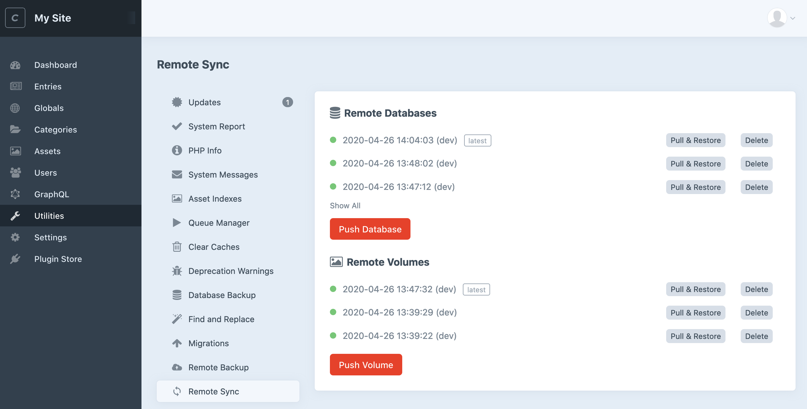
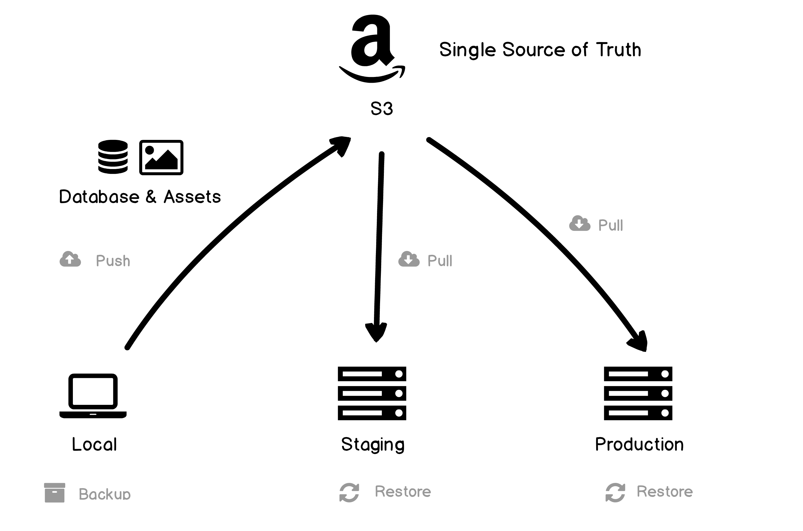
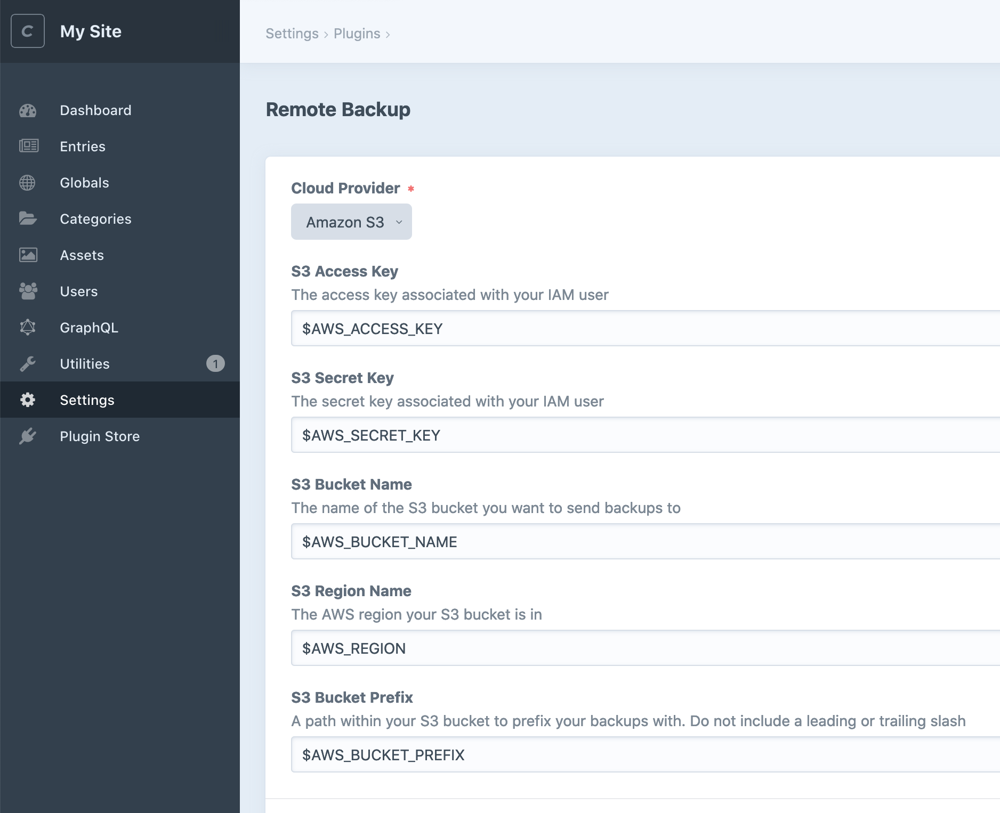

# Craft Remote Sync


Sync your database and assets across Craft environments using a remote destination like AWS S3.

## Overview



Craft Remote Sync makes it easy to sync your database and volume assets across a number of different environments from the comfort of the Craft Control Panel.

This makes it much easier to move your site from local development to staging and onto production and avoids the need to regularly SSH into servers to perform database dumps and restores.

To achieve this, the plugin uses a remote "single source of truth" (currently a S3 bucket) to push and pull database and asset/volumes files from.



For more information on the reasoning behind this approach see our blog post on the topic  ["Syncing your DB and assets across environments in Craft 3"](https://weareferal.com/tldr/syncing-your-db-and-assets-across-environments-in-craft-3/) or get in touch at [timmy@weareferal.com](mailto:timmy@weareferal.com)

This plugin is inspired by [Andrew Welsch's `craft-scripts` library](https://github.com/nystudio107/craft-scripts) who also [has a great blog post on syncing you DB and assets in Craft](https://nystudio107.com/blog/database-asset-syncing-between-environments-in-craft-cms).

## Requirements

This plugin requires Craft CMS 3.0.0 or later.

## Installation

To install the plugin, follow these instructions.

1. Open your terminal and go to your Craft project:

   ```sh
   $ cd /path/to/project
   ```

2. Then tell Composer to load the plugin:

   ```sh
   composer require weareferal/remote-sync
   ```

3. In the Control Panel, go to Settings → Plugins and click the _Install_ button for Craft Remote Sync.

## Configuration

The easiest way to configure Remote Sync is via the settings page:



Alternatively, if you want to configure the plugin on a per-environment basis, you can copy the `config/remote-backup.example.php` to your project's `config/remote-backup.php` file. These settings will override the Control Panel settings.

```php
<?php
return [
    '*' => [
        'cloudProvider' => 's3',
        //...
        'useQueue' => false,
    ],
    'dev' => [],
    'staging' => [],
    'production' => [],
];
```

Whichever approach you choose, you need to first configure your remote provider settings.

### Providers

Currently the only available provider is AWS S3 but more are to come soon (if you require another provider, please leave an issue on Github)

#### AWS

The details entered here correspond to your AWS S3 account and bucket that you want to use to sync files to. It's recommended to set up a new IAM user that has programmatic access (meaning via a access/secret key) to a private S3 bucket.

Once you have set this bucket up, you can either enter your AWS S3 details directly into the setting page/config file, or you can use environment variables via your `.env` file (this is the recommended approach as seen in the screenshot above). This latter approach is more portable and secure as it prevents any private access/secret key values being included in files that you might commit to Github. Furthermore is means these variables can be reused in other plugins etc.

Here is an example portion of a `.env` file:

```sh
...

AWS_ACCESS_KEY="..."
AWS_SECRET_KEY="..."
AWS_REGION="us-west-2"
AWS_BUCKET_NAME="feral-backups"
AWS_BUCKET_PREFIX="craft-backups/my-site"
```

## Usage

### Control Panel Utilties


From the "Remote Sync" tab in the utilities section you can:

- **Push** your database: this will automatically dump the database on your server and send it to your remote provider
- **Push** your volumes: this will automatically zip all configured volumes on your server and send them to your remote provider
- **Pull** your database: this will download the chosen remote database file and restore it locally to your server
- **Pull** your volumes: this will download the chosen remote volumes zip files and restore them all locally to your server
- **Delete** you database/volumes: this will delete the chosen remote file

### Command Line

There are also console commands available for creating, pushing and pulling backups:

```sh
- remote-sync/database                      Manage remote databases
    remote-sync/database/delete             Delete a remote database
    remote-sync/database/list               List remote databases
    remote-sync/database/pull               Pull remote database and restore it locally
    remote-sync/database/push               Push local database to remote destination

- remote-sync/volume                        Manage remote volumes
    remote-sync/volume/delete               Delete a remote volume
    remote-sync/volume/list                 List remote volumes
    remote-sync/volume/pull                 Pull remote volume and restore it locally
    remote-sync/volume/push                 Push local volume to remote destination
```

## Features

### Queue

You can optionally use Craft's built-in queue to sync files. This is useful when they are large and you don't want to have to wait on the Control Panel interface every time you backup. Instead, the files will be added to the queue and completed in the background.

You can enable this via the "Use Queue" lightswitch in the settings or via the `userQueue` settig in your config.

#### ⚠️ CLI commands and the queue

The CLI commands ignore the queue setting. In other words, they will always run synchrously. This is by design as it's likely you will want to see the results of these operations if they are part of your crontab or deployment script.

### Emergency Backup

When enabled, a local copy of both current database or volumes will be created and saved *before* pull & restoring a remote version.

This is a last resort in case you accidently pull and restore something you didn't mean to. Bear in mind that only 1 emergency backup is kept:

- `storage/sync/emergency-backup.sql` (database)
- `storage/sync/emergency-backup.zip` (volumes)

## Functionality

All synced files have the following filename structure:

```sh
my_site_dev_200202_200020_yjrnz62yj4_v3.3.20.1.sql
```

Which includes:

- Your site name
- Your current environment
- Date & time of backup
- Random 10 character string
- Craft version

It's important not to manually rename these files as the plugin relies on this structure.

## Pairing with Craft Remote Backup

[Craft Remote Backup](https://github.com/weareferal/craft-remote-backup) is a complimentary plugin that allows you to perform regular backups of both database and volumes to the same remote providers. Using these plugins together is a great way to manage remote files with your website.

When using these plugins together, it's sensible to use a different remote folder to hold your synced files and your backup files. To do this we recommend configuring your environment variables to include two separate file paths: one for sync and one for backup. 

With AWS this might look like:

```sh
AWS_ACCESS_KEY=
AWS_SECRET_KEY=
AWS_REGION="us-west-1"
AWS_BUCKET_NAME="feral-backups"
AWS_BUCKET_NAME="feral-backups"
AWS_BUCKET_SYNC_PREFIX="craft-sync/craft-test"
AWS_BUCKET_BACKUP_PREFIX="craft-backups/craft-test"
```

## Troubleshooting

If you are getting errors, the first thing to check is the Craft logs at `storage/logs/web.log`. The most likely issue is with your credentials, so double check that those are OK.

### Memory Limit Creating Volumes

When are syncing volumes, it's possible that your PHP memory limit will cause the process to crash. Make sure your memory limit is > than the volume folder you are trying to backup.

## Support


Brought to you by [Feral](https://weareferal.com). Any problems email [timmy@weareferal.com](mailto:timmy@weareferal.com?subject=Craft%20Env%20Sync%20Question) or leave an issue on Github.