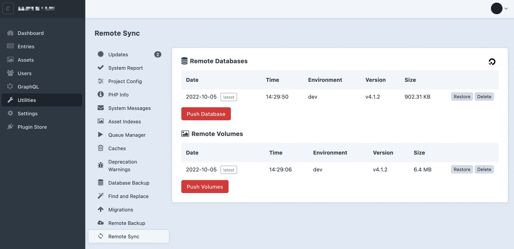
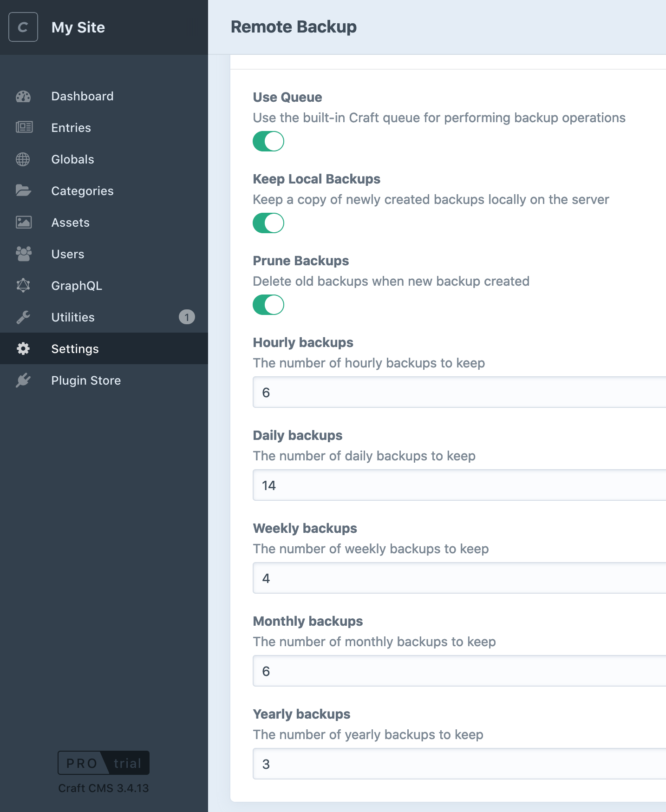
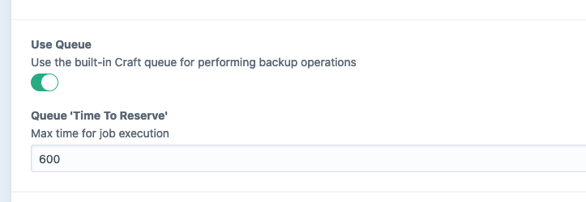

# Craft Remote Sync

Sync your database and assets across Craft environments via a remote destinations (AWS, Digital Ocean, Google Drive, Backblaze).

## Overview



Craft Remote Sync makes it easy to sync your database and volume assets across a number of different environments from the comfort of the Craft Control Panel.

This makes it much easier to move your site from local development to staging and onto production and avoids the need to regularly SSH into servers to perform database dumps and restores.

To achieve this, the plugin uses a remote "single source of truth" to push and pull database and asset/volumes files from.


For more information on the reasoning behind this approach see our blog post on the topic  ["Syncing your DB and assets across environments in Craft 3"](https://weareferal.com/tldr/syncing-your-db-and-assets-across-environments-in-craft-3/) or get in touch at [timmy@weareferal.com](mailto:timmy@weareferal.com)

This plugin is inspired by [Andrew Welsch's `craft-scripts` library](https://github.com/nystudio107/craft-scripts) who also [has a great blog post on syncing you DB and assets in Craft](https://nystudio107.com/blog/database-asset-syncing-between-environments-in-craft-cms).

## Requirements

This plugin requires Craft CMS 3.0.0 or later.

## Installation

To install the plugin, follow these instructions.

1. Open your terminal and go to your Craft project:

   ```sh
   $ cd /path/to/project
   ```

2. Then tell Composer to load the plugin:

   ```sh
   composer require weareferal/remote-sync
   ```

3. In the Control Panel, go to Settings → Plugins and click the _Install_ button for Craft Remote Sync.

## Configuration

Remote Sync supports a number of cloud providers. Each provider has slightly different configuration so please follow the links below to get a short guide for configuring your preferred provider.

Bear in mind that you will need to additionally install the relevant SDK for your provider.

- [Amazon S3](https://github.com/weareferal/craft-remote-backup/wiki/Amazon-S3)
- [Backblaze B2](https://github.com/weareferal/craft-remote-backup/wiki/Backblaze-B2)
- [Google Drive](https://github.com/weareferal/craft-remote-backup/wiki/Google-Drive)
- [Digital Ocean Spaces](https://github.com/weareferal/craft-remote-backup/wiki/Digital-Ocean-Spaces)

In each case you will be required to configure the plugin via the Control Panel settings page and optional (but recommended) environment variables.

## Usage

### Control Panel Utilities


From the "Remote Sync" tab in the utilities section you can:

- **Push** your database: this will automatically dump the database on your server and send it to your remote provider
- **Push** your volumes: this will automatically zip all configured volumes on your server and send them to your remote provider
- **Pull & Restore** your database: this will download the chosen remote database file and restore it locally to your server
- **Pull & Restore** your volumes: this will download the chosen remote volumes zip files and restore them all locally to your server
- **Delete** you database/volumes: this will delete the chosen remote file

### Command Line

There are also console commands available for creating, pushing and pulling backups:

```sh
- remote-sync/database                      Manage remote databases
    remote-sync/database/delete             Delete a remote database
    remote-sync/database/list               List remote databases
    remote-sync/database/prune              Prune remote database files
    remote-sync/database/pull               Pull remote database and restore it locally
    remote-sync/database/push               Push local database to remote destination

- remote-sync/volume                        Manage remote volumes
    remote-sync/volume/delete               Delete a remote volume
    remote-sync/volume/list                 List remote volumes
    remote-sync/volume/prune                Prune remote volume files
    remote-sync/volume/pull                 Pull remote volume and restore it locally
    remote-sync/volume/push                 Push local volume to remote destination
```

## Features

### Connection Testing

When setting up your remote destination, you can test the connection right from the settings page making it easy to troubleshoot issues. Use the "Test Connection" button below your provider settings to try it out.

### Queue

You can optionally use Craft's built-in queue to sync files. This is useful when they are large and you don't want to have to wait on the Control Panel interface every time you backup. Instead, the files will be added to the queue and completed in the background.

You can enable this via the "Use Queue" light-switch in the settings or via the `useQueue` setting in your config.

#### ⚠️ CLI commands

The CLI commands ignore the queue setting. In other words, they will always run synchronously. This is by design as it's likely you will want to see the results of these operations if they are part of your crontab or deployment script. 

### Emergency Backup

When enabled, a local copy of both current database or volumes will be created and saved *before* pull & restoring a remote version.

This is a last resort in case you accidentally pull and restore something you didn't mean to. Bear in mind that only 1 emergency backup is kept:

- `storage/sync/emergency-backup.sql` (database)
- `storage/sync/emergency-backup.zip` (volumes)

### Pruning



When enabled, "old" synced files will be automatically deleted when you push new files to the remote provider. This allows you to keep the number of remote files manageable (therefore keeping your costs down).

The "prune limit" controls how many of the most recent files you keep when pushing new files. For example, if the limit is 3 then Remote Sync will always keep the latest 3 remote database files as well as the latest 3 remote volume files. Any older files will be deleted.

When enabled, pruning will happen automatically while using the utilities interface. 

#### ⚠️ CLI commands

You can prune the remote files using two CLI console commands:

```sh
./craft remote-sync/database/prune
./craft remote-sync/volume/prune
```

Just like the queue setting above, pruning will not be automatically run when you are using the command line to push volumes, so you should run the prune command as part of any automated syncing scripts.

## Functionality

All synced files have the following filename structure:

```sh
my_site_dev_200202_200020_yjrnz62yj4_v3.3.20.1.sql
```

Which includes:

- Your site name
- Your current environment
- Date & time of backup
- Random 10 character string
- Craft version

It's important not to manually rename these files as the plugin relies on this structure. Like the queue setting above, pruning will not automatically happen when running console commands.

## Pairing with Craft Remote Backup

[Craft Remote Backup](https://github.com/weareferal/craft-remote-backup) is a complimentary plugin that allows you to perform regular backups of both database and volumes to the same remote providers. Using these plugins together is a great way to manage remote files with your website.

When using these plugins together, it's sensible to use a different remote folder to hold your synced files and your backup files. To do this we recommend configuring your environment variables to include two separate file paths: one for sync and one for backup. 

With AWS this might look like:

```sh
AWS_ACCESS_KEY=
AWS_SECRET_KEY=
AWS_REGION="us-west-1"
AWS_BUCKET_NAME="feral-backups"
AWS_BUCKET_NAME="feral-backups"
AWS_BUCKET_SYNC_PREFIX="craft-sync/craft-test"
AWS_BUCKET_BACKUP_PREFIX="craft-backup/craft-test"
```

## Troubleshooting

If you are getting errors, the first thing to check is the Craft logs at `storage/logs/web.log`. The most likely issue is with your credentials, so double check that those are OK.

### Memory Limit Creating Volumes

When are syncing volumes, it's possible that your PHP memory limit will cause the process to crash. Make sure your memory limit is > than the volume folder you are trying to backup.

### Large Files

If you have a lot of volume files or a large database to back up, there are a number of potential issues you may face.

#### Storage Issues

All data from your volumes is copied to the local server before being sent to the remote destination. It is then zipped and sent to the remote destination. This means that for every 1Gb you want to backup, you need 2Gb extra space.

#### Queue Operations Failing

If you are backing up via the web interface and using the queue, you might notice backup operations failing (sometimes silently)

##### TTR (Time to Reserve)

TTR ("Time To Reserve") is the max time (in seconds) that a queue operation can take. This is a Craft setting and not a PHP setting, so it's not affected by the `max_execution` time.

Remote Backup offers an easy way to adjust this value via the settings page, so if you are noticing issues backing-up then increase this value from the default 300 (5 minutes).



## Support

If you have any problems please leave an issue on Github or find us on the Craft Discord (username timmy).